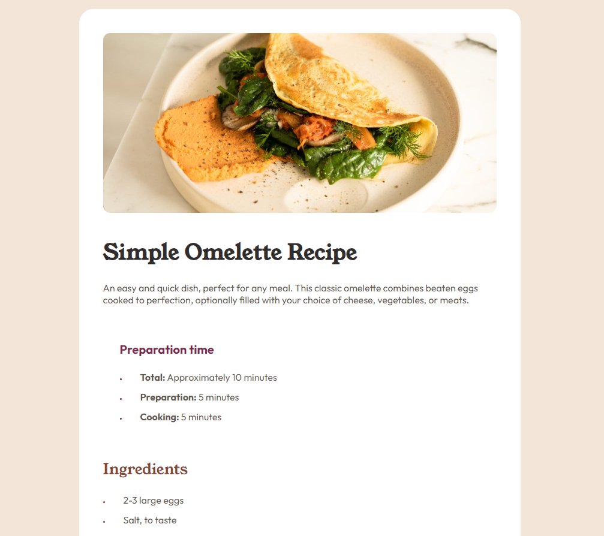

# Frontend Mentor - Recipe page solution

This is a solution to the [Recipe page challenge on Frontend Mentor](https://www.frontendmentor.io/challenges/recipe-page-KiTsR8QQKm). Frontend Mentor challenges help you improve your coding skills by building realistic projects. 

## Table of contents

- [Overview](#overview)
  - [Screenshot](#screenshot)
- [My process](#my-process)
  - [Built with](#built-with)
- [Author](#author)

## Overview

### Screenshot

## My process

### Built with

- Semantic HTML5 markup
- CSS custom properties
- Flexbox
- CSS Grid

## Author

- GitHub - [@GSBorges](https://github.com/GSBorgess)
- Frontend Mentor - [@GSBorges](https://www.frontendmentor.io/profile/GSBorgess)
- LinkedIn - [Gabriel Borges](https://www.linkedin.com/in/gabriel-borges-03a721240/)